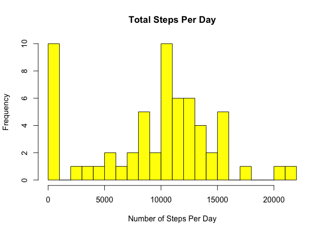
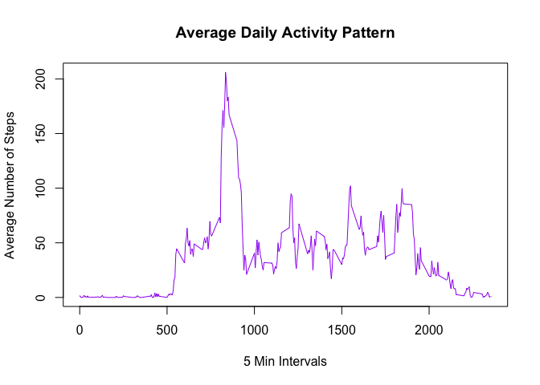
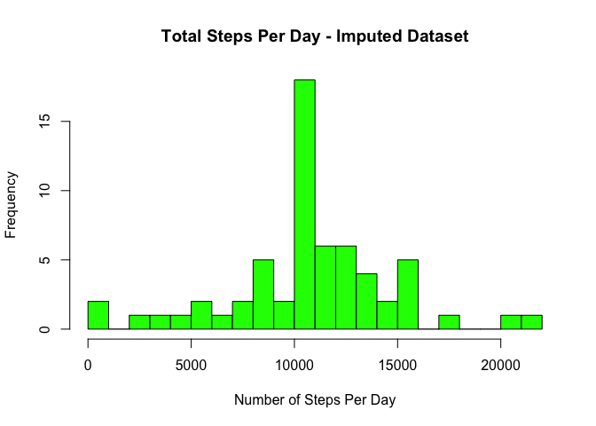
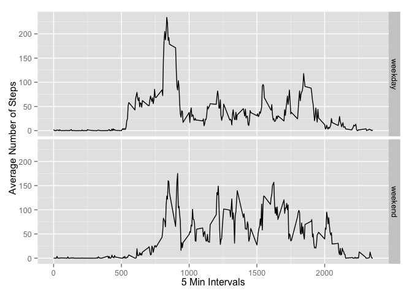

# Reproducible Research: Peer Assessment 1

## Loading and preprocessing the data

We first load in our data, for the purposes of this example we assume that 
activity.csv is already in place.

We transform our date column to Date objects for use later in our analysis


```r
df <- read.csv("activity.csv")
df$date <- as.Date(df$date)
str(df)
```

```
## 'data.frame':	17568 obs. of  3 variables:
##  $ steps   : int  NA NA NA NA NA NA NA NA NA NA ...
##  $ date    : Date, format: "2012-10-01" "2012-10-01" ...
##  $ interval: int  0 5 10 15 20 25 30 35 40 45 ...
```


## What is mean total number of steps taken per day?

1. Calculate the total number of steps taken per day and display this output. We transform our data frame to a data table for use for the rest
of the assignment.


```r
library(data.table)
dt <- data.table(df)
dtf <- dt[, sum(steps, na.rm=TRUE), by='date']
setnames(dtf,'V1', 'steps')
dtf
```

```
##           date steps
##  1: 2012-10-01     0
##  2: 2012-10-02   126
##  3: 2012-10-03 11352
##  4: 2012-10-04 12116
##  5: 2012-10-05 13294
##  6: 2012-10-06 15420
##  7: 2012-10-07 11015
##  8: 2012-10-08     0
##  9: 2012-10-09 12811
## 10: 2012-10-10  9900
## 11: 2012-10-11 10304
## 12: 2012-10-12 17382
## 13: 2012-10-13 12426
## 14: 2012-10-14 15098
## 15: 2012-10-15 10139
## 16: 2012-10-16 15084
## 17: 2012-10-17 13452
## 18: 2012-10-18 10056
## 19: 2012-10-19 11829
## 20: 2012-10-20 10395
## 21: 2012-10-21  8821
## 22: 2012-10-22 13460
## 23: 2012-10-23  8918
## 24: 2012-10-24  8355
## 25: 2012-10-25  2492
## 26: 2012-10-26  6778
## 27: 2012-10-27 10119
## 28: 2012-10-28 11458
## 29: 2012-10-29  5018
## 30: 2012-10-30  9819
## 31: 2012-10-31 15414
## 32: 2012-11-01     0
## 33: 2012-11-02 10600
## 34: 2012-11-03 10571
## 35: 2012-11-04     0
## 36: 2012-11-05 10439
## 37: 2012-11-06  8334
## 38: 2012-11-07 12883
## 39: 2012-11-08  3219
## 40: 2012-11-09     0
## 41: 2012-11-10     0
## 42: 2012-11-11 12608
## 43: 2012-11-12 10765
## 44: 2012-11-13  7336
## 45: 2012-11-14     0
## 46: 2012-11-15    41
## 47: 2012-11-16  5441
## 48: 2012-11-17 14339
## 49: 2012-11-18 15110
## 50: 2012-11-19  8841
## 51: 2012-11-20  4472
## 52: 2012-11-21 12787
## 53: 2012-11-22 20427
## 54: 2012-11-23 21194
## 55: 2012-11-24 14478
## 56: 2012-11-25 11834
## 57: 2012-11-26 11162
## 58: 2012-11-27 13646
## 59: 2012-11-28 10183
## 60: 2012-11-29  7047
## 61: 2012-11-30     0
##           date steps
```

Create a histogram to show the distribution of daily steps. 
We increased breaks from the default of 5 to give some granularity in 
our histogram.


```r
hist(dtf$steps, 
     breaks=20, 
     col="yellow", 
     xlab="Number of Steps Per Day", 
     main="Total Steps Per Day")
```

 

Display our mean and median steps per day.


```r
stepsMean <- mean(dtf$steps)
stepsMedian <- median(dtf$steps)

stepsMean
```

```
## [1] 9354.23
```

```r
stepsMedian
```

```
## [1] 10395
```

Our mean total number of steps per day is 9354.2295082.
Our median total number of steps per day is 10395.

## What is the average daily activity pattern?

Get the mean value for our steps v's intervals.


```r
timeSeriesData <- aggregate(dt$steps ~ dt$interval, dt, FUN=mean, na.rm = TRUE )
names(timeSeriesData) <- c("interval", "mean_steps")

plot(timeSeriesData$interval, 
     timeSeriesData$mean_steps, 
     type = "l", 
     col="purple", 
     xlab="5 Min Intervals", 
     ylab = "Average Number of Steps", 
     main = "Average Daily Activity Pattern")
```

 

Next get the 5 minute interval which contains the highest average number of steps.


```r
max_mean <- which.max(timeSeriesData$mean_steps)
max_interval_steps <- timeSeriesData[max_mean,]
max_interval_steps
```

```
##     interval mean_steps
## 104      835   206.1698
```

The 5 minute interval with the highest average number of steps is 835 with an average of 206 steps.

## Imputing missing values

1. Calculate and report the total number of missing values in the dataset 


```r
totalNAs <- sum(is.na(dt))
totalNAs
```

```
## [1] 2304
```

The total number of missing values is 2304

2. Replace the NA values.

We will use our average values for the relevant 5 minute interval computed above 
in timeSeriesData, and replace na values with the average using mapply. 


```r
doFill <- function (steps, interval) {
    returnVal <- NA
    if ( is.na(steps) ) {
        returnVal <- (round(timeSeriesData[timeSeriesData$interval == interval, 'mean_steps' ]))
    } else {
        returnVal <- c(steps)
    }
    
    return(returnVal)
}
filled_df <- df
filled_df$steps <- mapply(doFill, filled_df$steps, filled_df$interval)
head(filled_df)
```

```
##   steps       date interval
## 1     2 2012-10-01        0
## 2     0 2012-10-01        5
## 3     0 2012-10-01       10
## 4     0 2012-10-01       15
## 5     0 2012-10-01       20
## 6     2 2012-10-01       25
```

```r
numNAs <- sum(is.na(filled_df))

filled_dt <- data.table(filled_df)
filled_dtf <- filled_dt[, sum(steps), by='date']

setnames(filled_dtf, 'V1', 'steps')
```

Display a histogram with our imputed dataset.


```r
hist(filled_dtf$steps, 
     breaks=20, 
     col="green", 
     xlab="Number of Steps Per Day", 
     main="Total Steps Per Day - Imputed Dataset")
```

 

Evaluate the mean and median of our imputed dataset.


```r
filledStepsMean <- mean(filled_dtf$steps)
filledStepsMedian <- median(filled_dtf$steps)

filledStepsMean
```

```
## [1] 10765.64
```

```r
filledStepsMedian
```

```
## [1] 10762
```

In comparison to our earlier results our mean and median converge with the addition 
of the missing data, and our mean has increased.

## Are there differences in activity patterns between weekdays and weekends?

1. Add a factor variable with two levels, weekday and weekend


```r
library(dplyr)
```

```
## 
## Attaching package: 'dplyr'
## 
## The following objects are masked from 'package:data.table':
## 
##     between, last
## 
## The following object is masked from 'package:stats':
## 
##     filter
## 
## The following objects are masked from 'package:base':
## 
##     intersect, setdiff, setequal, union
```

```r
library(ggplot2)

checkDayOfWeek <- function ( date ) {
    day <- weekdays(date)
    returnVal <- ifelse( day %in% c("Saturday", "Sunday"), 'weekend', 'weekday')
    return(returnVal)
}

weekdays_df <- mutate(df, day_type = checkDayOfWeek(date)) 
weekdays_df$day_type <- as.factor(weekdays_df$day_type)

str(weekdays_df)
```

```
## 'data.frame':	17568 obs. of  4 variables:
##  $ steps   : int  NA NA NA NA NA NA NA NA NA NA ...
##  $ date    : Date, format: "2012-10-01" "2012-10-01" ...
##  $ interval: int  0 5 10 15 20 25 30 35 40 45 ...
##  $ day_type: Factor w/ 2 levels "weekday","weekend": 1 1 1 1 1 1 1 1 1 1 ...
```

```r
averages <- aggregate(steps ~ interval + day_type, data = weekdays_df, mean)
```

2. Panel Plot of Weekday and Weekend Activity


```r
ggplot(averages, aes(interval, steps)) + geom_line() + facet_grid(day_type ~ .) + xlab("5 Min Intervals") + ylab("Average Number of Steps")
```

 

The study subject is more active at the weekend.
